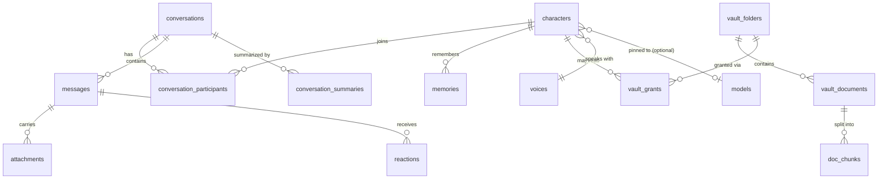

# PocketAI — Database Schema

One encrypted SQLite database (SQLCipher) per user profile: `pocket.db`. Vectors live in the same file via **sqlite-vec** virtual tables; keyword search via **FTS5**. Model weights and audio blobs live on the filesystem (content-addressed), referenced by path/hash.

Conventions: `id` = UUIDv7 stored as TEXT (sortable by creation time), timestamps = Unix epoch ms (INTEGER), booleans = INTEGER 0/1, flexible payloads = JSON in TEXT.

## Entity Overview



## DDL

```sql
PRAGMA foreign_keys = ON;
PRAGMA secure_delete = ON;          -- "delete means delete"

---------------------------------------------------------------
-- Characters
---------------------------------------------------------------
CREATE TABLE characters (
  id               TEXT PRIMARY KEY,
  name             TEXT NOT NULL,
  role_tagline     TEXT,                          -- "Writing partner"
  status_message   TEXT,                          -- "brewing metaphors ☕"
  avatar_kind      TEXT NOT NULL DEFAULT 'monogram', -- monogram|emoji|image
  avatar_value     TEXT,                          -- emoji, or file path for image
  accent_color     TEXT,                          -- hex; bubble tint in groups
  personality      TEXT,                          -- freeform description
  speaking_style   TEXT,
  backstory        TEXT,
  interests        TEXT,                          -- JSON array of strings
  greeting         TEXT,                          -- first message when chat opens
  system_prompt    TEXT,                          -- compiled OR user override
  system_prompt_is_custom INTEGER NOT NULL DEFAULT 0,
  memory_rules     TEXT,                          -- natural-language extraction rules
  creativity       REAL NOT NULL DEFAULT 0.7,     -- maps to temperature/top_p preset
  voice_id         TEXT REFERENCES voices(id) ON DELETE SET NULL,
  model_id         TEXT REFERENCES models(id) ON DELETE SET NULL, -- NULL = global default
  is_builtin       INTEGER NOT NULL DEFAULT 0,    -- starter cast (still editable)
  is_archived      INTEGER NOT NULL DEFAULT 0,
  created_at       INTEGER NOT NULL,
  updated_at       INTEGER NOT NULL
);

---------------------------------------------------------------
-- Conversations (1:1 and group share one shape)
---------------------------------------------------------------
CREATE TABLE conversations (
  id               TEXT PRIMARY KEY,
  kind             TEXT NOT NULL CHECK (kind IN ('direct','group')),
  title            TEXT,                          -- groups; NULL for direct (derive)
  group_avatar     TEXT,
  wallpaper        TEXT,                          -- asset key or file path
  is_pinned        INTEGER NOT NULL DEFAULT 0,
  is_muted         INTEGER NOT NULL DEFAULT 0,
  is_archived      INTEGER NOT NULL DEFAULT 0,
  -- Group director settings
  max_ai_turns     INTEGER NOT NULL DEFAULT 2,    -- AI-to-AI replies per user turn
  -- Denormalized for the home list (updated in message-write txn)
  last_message_at  INTEGER,
  last_preview     TEXT,
  unread_count     INTEGER NOT NULL DEFAULT 0,
  -- llama.cpp KV-cache session file for fast reopen
  session_path     TEXT,
  session_token_count INTEGER NOT NULL DEFAULT 0,
  created_at       INTEGER NOT NULL
);

CREATE TABLE conversation_participants (
  conversation_id  TEXT NOT NULL REFERENCES conversations(id) ON DELETE CASCADE,
  character_id     TEXT NOT NULL REFERENCES characters(id)    ON DELETE CASCADE,
  joined_at        INTEGER NOT NULL,
  PRIMARY KEY (conversation_id, character_id)
);

CREATE INDEX idx_conversations_home
  ON conversations (is_archived, is_pinned DESC, last_message_at DESC);

---------------------------------------------------------------
-- Messages
---------------------------------------------------------------
CREATE TABLE messages (
  id               TEXT PRIMARY KEY,
  conversation_id  TEXT NOT NULL REFERENCES conversations(id) ON DELETE CASCADE,
  sender_kind      TEXT NOT NULL CHECK (sender_kind IN ('user','character','system')),
  sender_character_id TEXT REFERENCES characters(id) ON DELETE SET NULL,
  kind             TEXT NOT NULL DEFAULT 'text'
                     CHECK (kind IN ('text','voice','image','document','event')),
  body             TEXT,                          -- text, or transcript for voice
  status           TEXT NOT NULL DEFAULT 'done'
                     CHECK (status IN ('pending','streaming','done','stopped','error')),
  reply_to_id      TEXT REFERENCES messages(id) ON DELETE SET NULL,
  is_edited        INTEGER NOT NULL DEFAULT 0,
  -- generation metadata (never shown in chat UI; for debugging/stats screen)
  gen_meta         TEXT,                          -- JSON: model_id, tok/s, seed…
  created_at       INTEGER NOT NULL
);

CREATE INDEX idx_messages_conv ON messages (conversation_id, created_at);

CREATE TABLE attachments (
  id               TEXT PRIMARY KEY,
  message_id       TEXT NOT NULL REFERENCES messages(id) ON DELETE CASCADE,
  kind             TEXT NOT NULL CHECK (kind IN ('image','audio','document')),
  file_path        TEXT NOT NULL,                 -- app-private storage
  mime_type        TEXT,
  byte_size        INTEGER,
  duration_ms      INTEGER,                       -- audio
  width            INTEGER, height INTEGER,       -- images
  waveform         TEXT,                          -- JSON peaks for voice bubbles
  caption_cache    TEXT                           -- vision-model description, cached
);

CREATE TABLE reactions (
  message_id       TEXT NOT NULL REFERENCES messages(id) ON DELETE CASCADE,
  reactor_kind     TEXT NOT NULL CHECK (reactor_kind IN ('user','character')),
  reactor_character_id TEXT REFERENCES characters(id) ON DELETE CASCADE,
  emoji            TEXT NOT NULL,
  created_at       INTEGER NOT NULL,
  PRIMARY KEY (message_id, reactor_kind, reactor_character_id, emoji)
);

-- Keyword search over messages
CREATE VIRTUAL TABLE messages_fts USING fts5(
  body, content='messages', content_rowid='rowid', tokenize='unicode61'
);

---------------------------------------------------------------
-- Memory system
---------------------------------------------------------------
CREATE TABLE memories (
  id               TEXT PRIMARY KEY,
  character_id     TEXT REFERENCES characters(id) ON DELETE CASCADE,
                                                 -- NULL = global "About You" fact
  scope            TEXT NOT NULL DEFAULT 'character'
                     CHECK (scope IN ('character','user_profile')),
  content          TEXT NOT NULL,                 -- "User's dog is named Biscuit"
  source_kind      TEXT NOT NULL DEFAULT 'extracted'
                     CHECK (source_kind IN ('extracted','user_added','imported')),
  source_message_id TEXT REFERENCES messages(id) ON DELETE SET NULL,
  importance       REAL NOT NULL DEFAULT 0.5,     -- extractor-scored 0..1
  is_pinned        INTEGER NOT NULL DEFAULT 0,
  last_recalled_at INTEGER,
  created_at       INTEGER NOT NULL,
  updated_at       INTEGER NOT NULL
);

CREATE INDEX idx_memories_char ON memories (character_id, is_pinned DESC, importance DESC);

-- Rolling summaries keep long chats coherent beyond the context window
CREATE TABLE conversation_summaries (
  id               TEXT PRIMARY KEY,
  conversation_id  TEXT NOT NULL REFERENCES conversations(id) ON DELETE CASCADE,
  through_message_id TEXT NOT NULL REFERENCES messages(id) ON DELETE CASCADE,
  content          TEXT NOT NULL,
  level            INTEGER NOT NULL DEFAULT 1,    -- 1=segment, 2=summary-of-summaries
  created_at       INTEGER NOT NULL
);

---------------------------------------------------------------
-- Knowledge Vault
---------------------------------------------------------------
CREATE TABLE vault_folders (
  id               TEXT PRIMARY KEY,
  name             TEXT NOT NULL,
  parent_id        TEXT REFERENCES vault_folders(id) ON DELETE CASCADE,
  created_at       INTEGER NOT NULL
);

CREATE TABLE vault_documents (
  id               TEXT PRIMARY KEY,
  folder_id        TEXT REFERENCES vault_folders(id) ON DELETE SET NULL,
  title            TEXT NOT NULL,
  kind             TEXT NOT NULL CHECK (kind IN ('pdf','markdown','text','image','note')),
  file_path        TEXT,                          -- NULL for in-app notes
  content_sha256   TEXT,
  byte_size        INTEGER,
  index_status     TEXT NOT NULL DEFAULT 'pending'
                     CHECK (index_status IN ('pending','indexing','ready','failed')),
  chunk_count      INTEGER NOT NULL DEFAULT 0,
  created_at       INTEGER NOT NULL,
  updated_at       INTEGER NOT NULL
);

CREATE TABLE doc_chunks (
  id               TEXT PRIMARY KEY,
  document_id      TEXT NOT NULL REFERENCES vault_documents(id) ON DELETE CASCADE,
  seq              INTEGER NOT NULL,              -- order within document
  content          TEXT NOT NULL,
  heading_path     TEXT,                          -- "Ch 4 > The Siege"
  token_count      INTEGER
);

CREATE INDEX idx_chunks_doc ON doc_chunks (document_id, seq);

-- Per-character access: grant a folder or a single document
CREATE TABLE vault_grants (
  character_id     TEXT NOT NULL REFERENCES characters(id) ON DELETE CASCADE,
  folder_id        TEXT REFERENCES vault_folders(id)   ON DELETE CASCADE,
  document_id      TEXT REFERENCES vault_documents(id) ON DELETE CASCADE,
  created_at       INTEGER NOT NULL,
  CHECK ((folder_id IS NULL) != (document_id IS NULL)),  -- exactly one target
  UNIQUE (character_id, folder_id, document_id)
);

-- Keyword search over vault
CREATE VIRTUAL TABLE chunks_fts USING fts5(
  content, heading_path, content='doc_chunks', content_rowid='rowid'
);

---------------------------------------------------------------
-- Vector index (sqlite-vec) — one table, discriminated by kind
---------------------------------------------------------------
-- dim matches the bundled embedder (e.g. 384)
CREATE VIRTUAL TABLE embeddings USING vec0(
  embedding FLOAT[384],
  kind      TEXT,            -- 'memory' | 'chunk' | 'message'
  ref_id    TEXT             -- id in memories / doc_chunks / messages
);
-- App layer keeps embeddings in sync on insert/update/delete of sources.

---------------------------------------------------------------
-- Models, voices, settings
---------------------------------------------------------------
CREATE TABLE models (
  id               TEXT PRIMARY KEY,              -- catalog slug: 'qwen3-4b-q4km'
  display_name     TEXT NOT NULL,                 -- "Quick & Smart"
  family           TEXT NOT NULL,                 -- gemma|llama|qwen|phi|mistral|whisper|piper|embedder|vision-proj
  capability       TEXT NOT NULL CHECK (capability IN
                     ('chat','vision','embed','stt','tts')),
  file_path        TEXT,                          -- NULL until downloaded
  sha256           TEXT NOT NULL,
  byte_size        INTEGER NOT NULL,
  min_ram_mb       INTEGER NOT NULL,
  ctx_length       INTEGER,
  license_name     TEXT NOT NULL,
  license_url      TEXT,
  download_url     TEXT NOT NULL,
  status           TEXT NOT NULL DEFAULT 'available'
                     CHECK (status IN ('available','downloading','installed','failed')),
  download_progress REAL NOT NULL DEFAULT 0,
  is_default_chat  INTEGER NOT NULL DEFAULT 0,
  installed_at     INTEGER
);

CREATE TABLE voices (
  id               TEXT PRIMARY KEY,              -- 'piper-ember'
  display_name     TEXT NOT NULL,                 -- "Ember"
  model_id         TEXT NOT NULL REFERENCES models(id) ON DELETE CASCADE,
  language         TEXT NOT NULL DEFAULT 'en',
  pitch            REAL NOT NULL DEFAULT 1.0,
  speed            REAL NOT NULL DEFAULT 1.0
);

CREATE TABLE settings (            -- small typed KV; JSON values
  key              TEXT PRIMARY KEY,
  value            TEXT NOT NULL
);
-- keys: theme, default_model_id, app_lock, response_pacing,
--       content_prefs, onboarding_done, pro_unlocked, ...
```

## Design Notes

1. **Direct + group chats share one shape.** A direct chat is a `conversations` row of kind `direct` with exactly one participant. Promoting UX later ("add a character to this chat") is a data no-op.
2. **Home screen is one indexed query.** `last_message_at` / `last_preview` / `unread_count` are denormalized onto `conversations` inside the message-write transaction — the conversation list never joins `messages`.
3. **One vector table, three sources.** Memories, vault chunks, and (optionally) messages all embed into `embeddings` with a `kind` discriminator — a single ANN query retrieves across memory + knowledge with one pass, filtered by grants in the app layer.
4. **Delete means delete.** `secure_delete=ON`, FK cascades from character/conversation down through messages → attachments/reactions/embeddings, file-store attachments removed in the same job, and VACUUM after bulk purges. Export = the SQLCipher file + attachments dir in one archive.
5. **KV-cache sessions** (`conversations.session_path`) make chat reopening fast: reload the saved prompt cache, append only new turns. Invalidated on model switch, character edit, or rewind.
6. **`gen_meta` keeps the product honest.** Debug/perf info exists for a hidden diagnostics screen and beta reports, but is schema-quarantined away from anything the chat UI renders.
7. **Migrations** via drift's versioned migrator; every release ships forward migrations; export archives embed `schema_version` for import compatibility.
