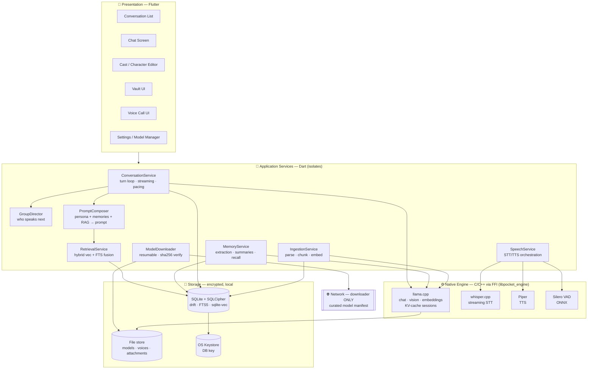
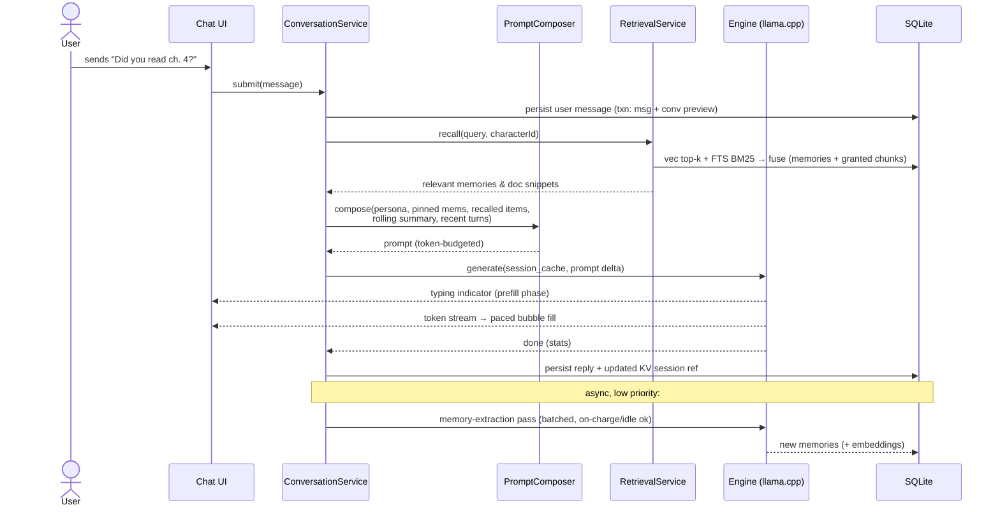
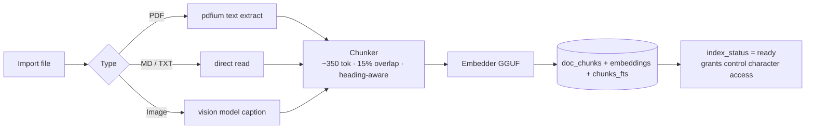
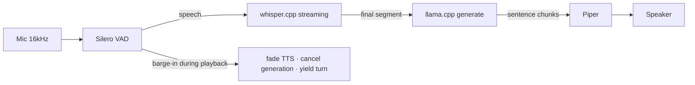

# PocketAI — System Architecture

Everything runs in one app process (plus native worker threads). There is no server. The only network component is the model downloader.

## 1. Layer Diagram



**Threading model:** Flutter UI thread renders only. Application services run in Dart isolates; the native engine owns its own thread pool with a **single-generation inference queue** (one active LLM job; STT/TTS/embedding jobs schedule around it with priorities: interactive chat > voice > background extraction > indexing).

## 2. Message Turn — Data Flow



**Context budget (per turn, example 8k ctx):** system/persona ≈ 600 tok · pinned memories ≤ 300 · recalled memories/RAG ≤ 900 · rolling summary ≤ 500 · recent verbatim turns = remainder ≈ 5.5k · reply reserve ≈ 700. The PromptComposer enforces this budget deterministically; when history exceeds the verbatim window, MemoryService folds the overflow into the rolling summary (level-1 segments, level-2 compaction).

## 3. Memory Engine

Three cooperating tiers:

| Tier | What | Written | Read |
|---|---|---|---|
| **Verbatim window** | Last N turns raw | every message | every turn |
| **Rolling summary** | `conversation_summaries` (segment → compacted) | when overflow crosses threshold | every turn |
| **Durable memories** | `memories` (facts, prefs, events) | background extraction pass + user-added | retrieved by relevance; pinned always |

Extraction pass = small prompt over the latest segment: *"List durable facts worth remembering about the user or ongoing projects, honoring these rules: {character.memory_rules}"* → dedup against existing (vector similarity ≥ τ merges instead of inserting) → score importance → embed → store. Everything user-visible and editable in the Memory Browser.

## 4. Knowledge Vault Ingestion



Runs at background priority; UI shows per-document progress; failures leave the document queryable by keyword only (graceful degradation).

## 5. Group Chat Orchestration

```mermaid
flowchart TD
    UM[User message arrives] --> D{Director}
    D -->|@mention| M1[Mentioned character speaks]
    D -->|else| SCORE[Score participants:<br/>addressed-by-name · topic relevance ·<br/>recency balance · persona chattiness]
    SCORE --> S1[Top character speaks]
    M1 --> R{Continue?}
    S1 --> R
    R -->|another character has high<br/>response affinity AND<br/>ai_turns < max_ai_turns| S2[Next character replies<br/>sees full transcript]
    S2 --> R
    R -->|cap reached or low affinity| W[Wait for user<br/>UI offers “let them keep talking”]
```

The Director is deterministic heuristics + one cheap LLM classification ("who is being addressed / who would naturally respond?") — not a heavyweight agent framework. Each character's generation is prompted with its own persona + private memories + the shared transcript, so characters genuinely differ in what they "know."

## 6. Voice Call Pipeline



Latency budget to first audio ≈ 1.5–2.5 s on target phones: VAD endpoint 300 ms · STT final 300–600 ms · LLM first sentence 600–1200 ms · TTS first chunk 150–300 ms.

## 7. Security & Privacy Architecture

- **DB:** SQLCipher, key generated on first run, stored in Android Keystore / iOS Keychain / platform credential store; optional app-lock gates key release behind biometric/PIN.
- **Files:** attachments/models in app-private storage; attachments optionally encrypted (ChaCha20) with the same key hierarchy.
- **Network:** a single `ModelDownloader` component owns the only HTTP client; certificate-pinned manifest; every download SHA-256-verified. A local "network log" screen shows every request ever made — user-auditable proof of the offline promise.
- **Deletion:** cascade + `secure_delete` + file-store sweep + VACUUM (see schema doc).
- **No telemetry.** Beta builds with consented analytics are a separate build flavor, never the store build.

## 8. Failure & Resource Handling

| Condition | Behavior |
|---|---|
| OOM risk (model + ctx > budget) | Preflight RAM check → suggest lighter model or trim context; never hard-crash mid-chat |
| Thermal throttle | Engine monitors sustained tok/s + platform thermal API → pacing slows, then friendly pause ("taking a breather") |
| Battery saver | Defer background extraction/indexing to charging or user-idle |
| App killed mid-generation | Message row status `stopped`; on reopen, bubble shows "tap to continue" |
| Corrupt/missing model file | Hash check on load → re-download prompt; chats and data unaffected |
| DB migration failure | Pre-migration backup copy of `pocket.db`; auto-rollback + report screen |
