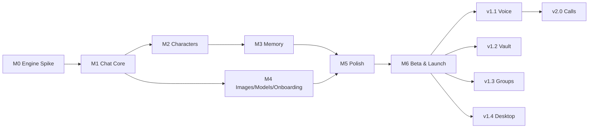

# PocketAI — MVP Roadmap

**MVP definition:** the smallest product that *proves the thesis* — "texting an AI contact that remembers you, fully offline, feels magical." That is: polished 1:1 chat + characters + memory + images + model onboarding, on **Android + iOS**. Voice, vault, and groups are fast-follows; desktop rides along behind a flag.

The bar is *depth over breadth*: five perfect screens beat fifteen adequate ones.

## Milestones

### M0 — Engine Spike (de-risk first) ✅ gate for everything else
- llama.cpp built & running via FFI on a real mid-range Android phone and an iPhone 12-class device.
- Measured: tok/s, first-token latency, RAM, thermal behavior for candidate models (Gemma/Qwen/Llama/Phi in 1.5B–8B, Q4).
- **Exit criteria:** ≥ 8 tok/s sustained and first token < 2.5 s on min-spec with the chosen default model; KV-cache session save/restore works. *If this gate fails, the min-spec or default model changes now — not in month 5.*

### M1 — Chat Core
- Conversation list, chat screen, bubbles, day separators, paced streaming with typing indicator.
- Message persistence (encrypted DB), conversation CRUD, stop/continue generation, edit-my-message.
- One hardcoded character. Light/dark theme.
- **Exit:** 30-minute conversation feels smooth; kill/reopen app mid-stream recovers cleanly.

### M2 — Characters
- Character model + creation wizard (3 steps + Advanced), starter cast (8 characters), contact cards, per-character chat isolation, greetings, statuses, creativity slider.
- PromptComposer v1 (persona compilation).
- **Exit:** distinct characters *feel* distinct in blind testing; creating a character takes < 90 seconds.

### M3 — Memory
- Rolling summaries; background fact extraction; memory browser (view/edit/delete/pin); "forget everything"; recall injected into prompts (vector + FTS hybrid).
- **Exit:** the "remember test" — tell a character three personal facts, chat 200+ messages about other things across app restarts, then ask; ≥ 2 of 3 recalled naturally.

### M4 — Images + Model Manager + Onboarding
- Vision capability pack: send photo → character discusses it (caption cached).
- First-run flow: device detection → recommended bundle → resumable download; model manager in Settings; curated catalog (per-family tiers).
- **Exit:** fresh install → first reply in < 10 minutes on Wi-Fi; download survives airplane-mode interruptions.

### M5 — Polish & Hardening (the "feels like iMessage" milestone)
- Reactions, wallpapers, in-chat + global search, haptics, animations, empty states, error states, thermal/battery guardrails, app lock, export/backup.
- Performance pass: p90 targets on min-spec matrix; memory-leak soak tests.
- **Exit:** beta testers describe it unprompted as "like texting a person," not "a ChatGPT app."

### M6 — Closed Beta → Launch
- 200–500 tester beta (consented-analytics build), two stabilization cycles, store assets, licensing/attribution screen, age-rating & review compliance.
- **Launch scope:** Android + iOS, 1:1 chat, characters, memory, images, onboarding. **Pro unlock IAP** live (see monetization).

## Fast-Follow Releases

| Release | Contents |
|---|---|
| **v1.1 — Voice** | Voice notes (STT+TTS packs), per-character voices, waveform bubbles |
| **v1.2 — Vault** | Knowledge Vault import/indexing/grants, document chat, semantic search |
| **v1.3 — Groups** | Group chats + director, @mentions, group templates, character-to-character banter |
| **v1.4 — Desktop** | macOS first (same codebase, two-pane), then Windows/Linux; character file import/export |
| **v2.0 — Calls** | Full-duplex voice call mode with barge-in; character check-ins (opt-in) |

## Explicitly Deferred From MVP (and why)

| Feature | Why deferred |
|---|---|
| Group chats | Orchestration quality risk; 1:1 must prove the magic first |
| Knowledge Vault | RAG quality tuning is a time sink; memory system covers the emotional core |
| Voice | Three more native engines to harden; ship as one coherent v1.1 story |
| Desktop | Rides the same codebase; mobile-first principle means mobile *ships* first |
| Character marketplace / sharing UI | File export covers enthusiasts; marketplace is monetization phase 2 |
| Image generation | Different runtime + safety surface; separate capability pack later |

## Dependency Graph

